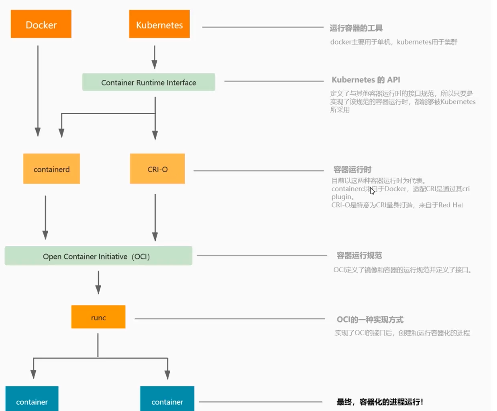
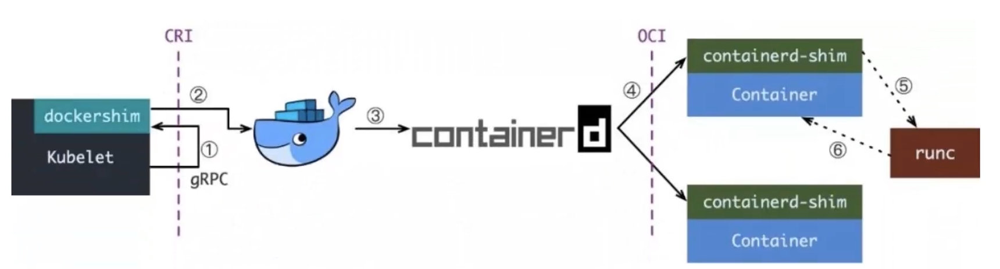
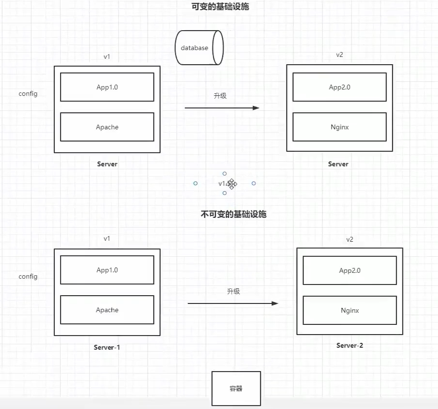

# 02 云原生基本功

- 容器
- 不可变基础设施
- 声明式API
- 微服务
- 服务网格

## 云原生概述

### 定义

[cncf 官网](https://www.cncf.io/)  
[Cloud Native Definition](https://www.cncf.io/about/who-we-are/)

Cloud native technologies empower organizations to build and run scalable applications in modern, dynamic environments such as public, private, and hybrid clouds. Containers, service meshes, microservices, immutable infrastructure, and declarative APIs exemplify this approach.

These techniques enable loosely coupled systems that are resilient, manageable, and observable. Combined with robust automation, they allow engineers to make high-impact changes frequently and predictably with minimal toil.

The Cloud Native Computing Foundation seeks to drive adoption of this paradigm by fostering and sustaining an ecosystem of open source, vendor-neutral projects. We democratize state-of-the-art patterns to make these innovations accessible for everyone.

云原生技术有利于各组织在公有云、私有云和混合云等新型动态环境中，构建和运行可弹性扩展的应用。云原生的代表技术包括容器、服务网格、微服务、不可变基础设施和声明式API。

这些技术能够构建容错性好、易于管理和便于观察的松耦合系统。结合可靠的自动化手段，云原生技术使工程师能够轻松地对系统作出频繁和可预测的重大变更。

云原生计算基金会（CNCF）致力于培育和维护一个厂商中立的开源生态系统，来推广云原生技术。我们通过将最前沿的模式民主化，让这些创新为大众所用。

### 生态

[生态图](https://landscape.cncf.io/)

## 容器

### 容器调用链路

### 主流容器技术之间的联系

#### K8s与Docker

而在k8s发布后续的版本将会移除对dockershim的支持，因为在docker中与k8s存在网络和存储功能的重叠。

## 不可变基础设施

每次发布一个新版本使用新的容器发布，不去动老的版本。 

可变的基础设施VS不可变的基础设施

